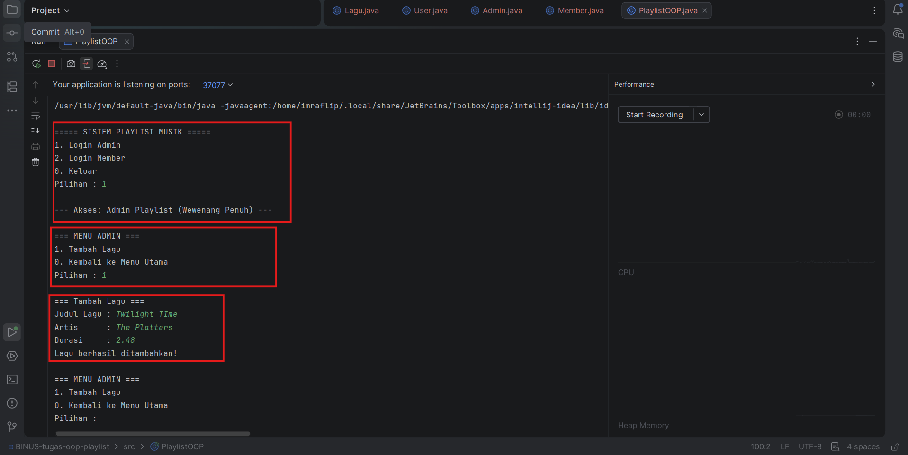
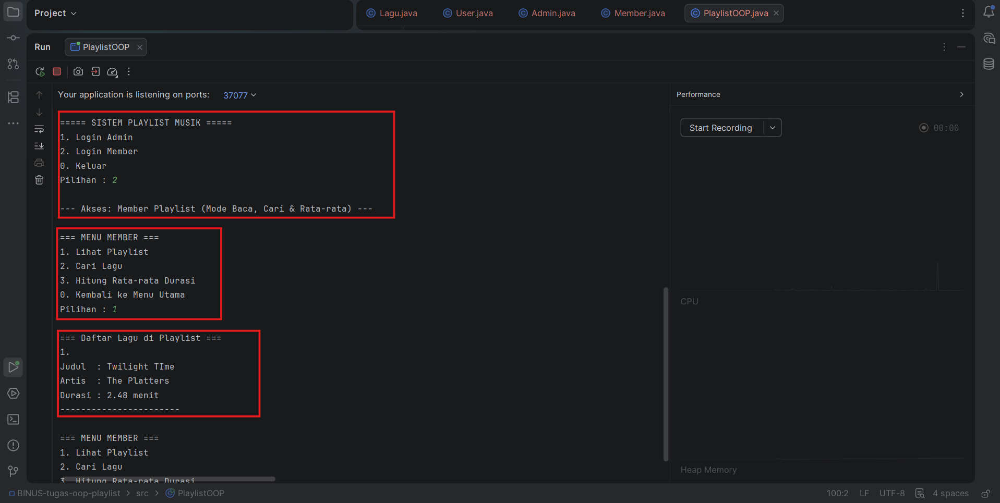

# Tugas OOP - Sistem Manajemen Playlist Musik

Program Java sederhana untuk mengelola daftar putar (playlist) musik menggunakan konsep OOP, mencakup Encapsulation, Inheritance, dan Polymorphism. Program ini memiliki dua role pengguna yaitu Admin (untuk menambah lagu) dan Member (untuk melihat, mencari, dan menghitung rata-rata lagu).

## File
- `Lagu.java` — Class blueprint yang menyimpan atribut lagu (judul, artis, durasi) dengan menerapkan enkapsulasi.
- `User.java` — Parent class yang menyimpan atribut dasar pengguna dan method polimorfisme dasar.
- `Admin.java` — Child class turunan dari User yang memiliki hak akses untuk menambah lagu ke dalam sistem.
- `Member.java` — Child class turunan dari User yang memiliki hak akses untuk menampilkan, mencari, dan menghitung rata-rata durasi lagu.
- `PlaylistOOP.java` — Program utama (Main class) yang menjalankan looping menu, switch-case, dan pembuatan objek role.

## Cara Menjalankan
```shell
javac *.java
java PlaylistOOP
```

## Contoh Hasil Run

Proses Login Admin dan Input Lagu:
```text
Judul Lagu : Twilight Time
Artis      : The Platters
Durasi     : 2.48
```


Proses Login Member dan Output Daftar Lagu:

