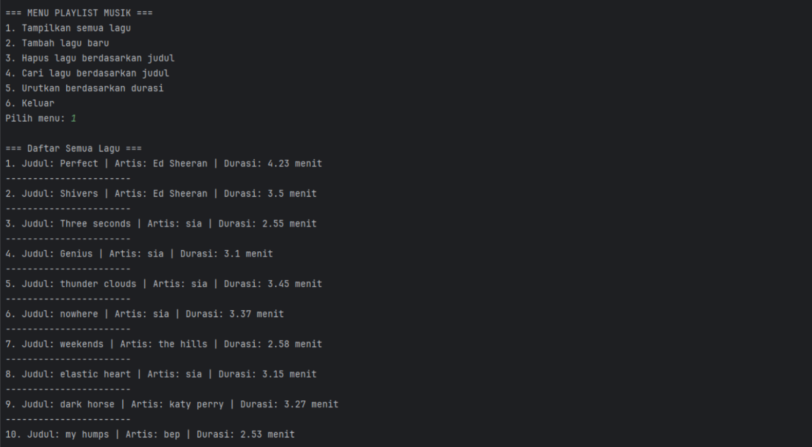
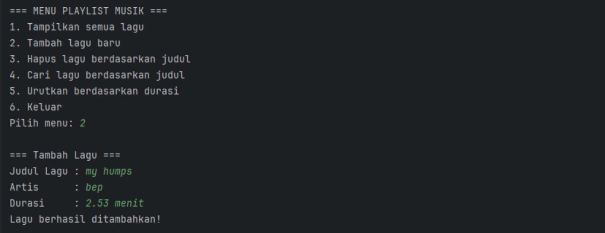
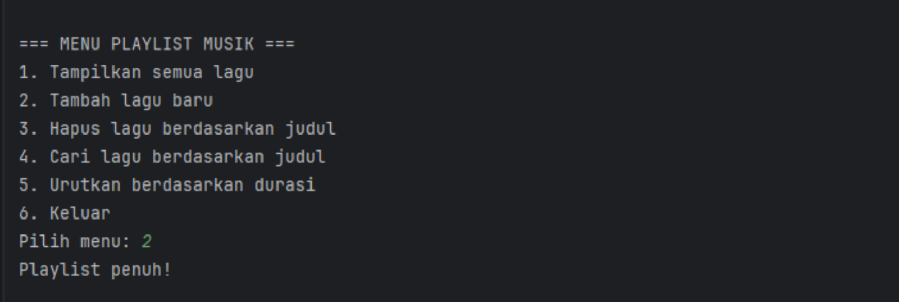
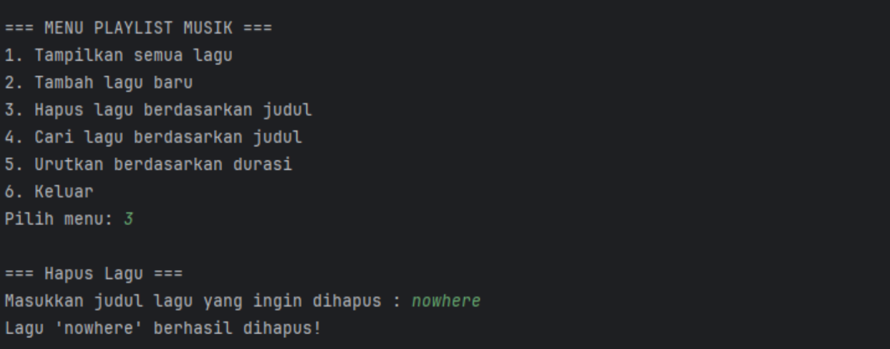
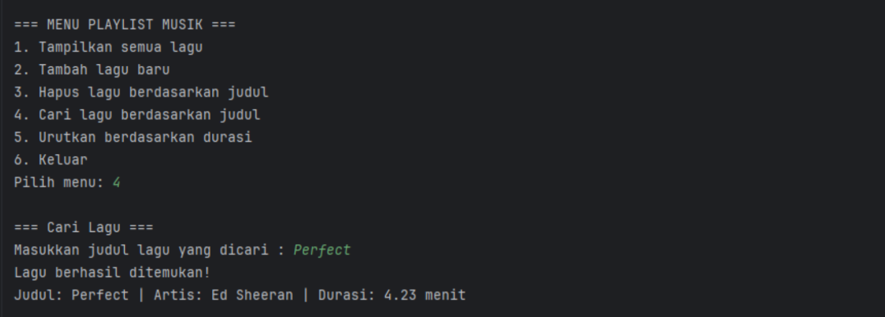
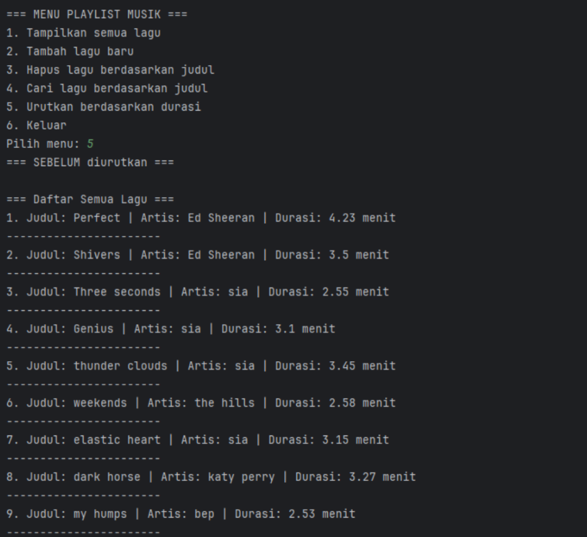

# Tugas Struktur Data - Sistem Manajemen Playlist Musik (Array)

Program Java sederhana untuk mengelola daftar putar (playlist) musik menggunakan **array statis** berkapasitas maksimum 10 data lagu. Setiap lagu memiliki atribut judul, artist, dan durasi. Program menyediakan menu untuk menampilkan, menambah, menghapus, mencari, dan mengurutkan lagu.

## File
- `Lagu.java` — Class blueprint yang menyimpan atribut lagu (judul, artist, durasi) dengan menerapkan enkapsulasi.
- `PlaylistArray.java` — Program utama (Main class) yang menjalankan menu, operasi array, serta algoritma searching dan sorting.

## Cara Menjalankan
```shell
cd src
javac *.java
java PlaylistArray
```

---

# Screenshot Fungsi Program Berjalan Dengan Sesuai

## 1. Tampilkan semua lagu



Method tampilkan semua lagu berfungsi dengan baik, program dapat menampilkan seluruh data lagu dalam array, sesuai dengan soal yang diberikan yaitu 10 data lagu.

## 2. Tambah lagu baru



Method tambah lagu berfungsi sebagaimana mestinya, dapat menambah data ke dalam array dengan atribut judul, artist, dan durasi.

Atribut array statis dengan kapasitas maksimum 10 data lagu, jika menambahkan data lagu namun data sudah terisi semua maka akan tampil pesan **Playlist penuh!**.



## 3. Hapus lagu berdasarkan judul



Method hapus lagu berjalan melalui tiga tahapan utama dalam operasi struktur data array, yaitu: Pengecekan (Validation), Pencarian posisi (Searching), dan Penghapusan dengan Pergeseran elemen (Deletion & Shifting).

## 4. Cari lagu berdasarkan judul



Method cari lagu berjalan menggunakan algoritma Linear Search (pencarian lurus/berurutan). Cara kerjanya terstruktur, memeriksa data satu per satu dari awal sampai akhir.

## 5. Urutkan berdasarkan durasi secara ascending (Bubble Sort)



Method urutkan lagu berjalan menggunakan algoritma Bubble Sort secara ascending (dari durasi terpendek ke terlama).
